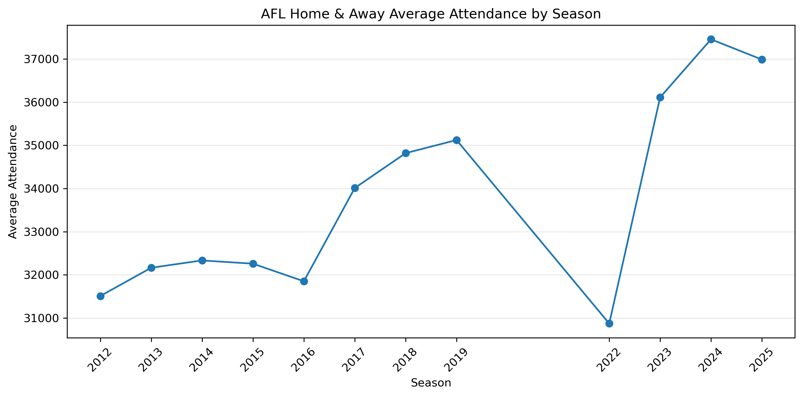
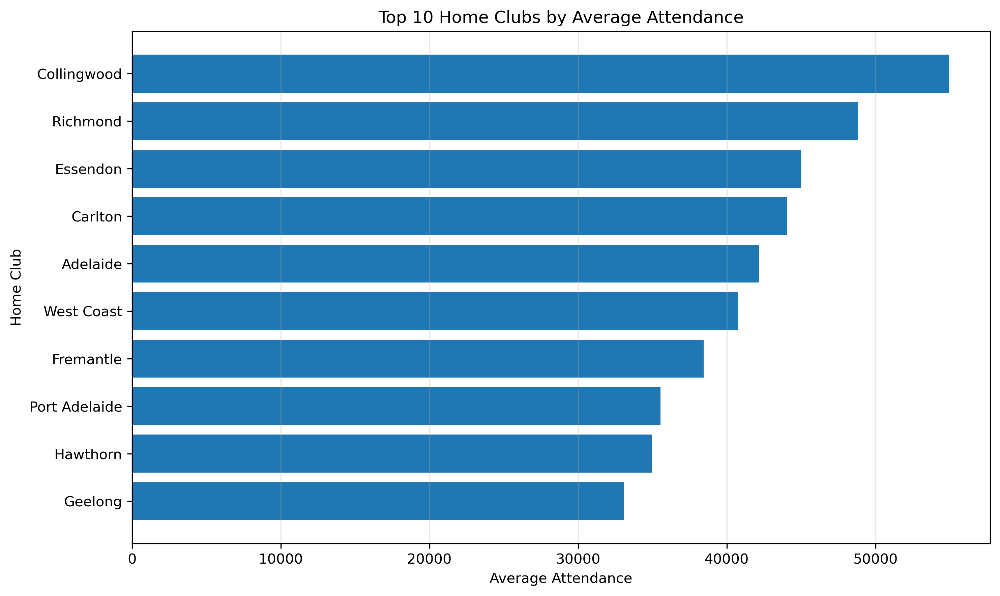
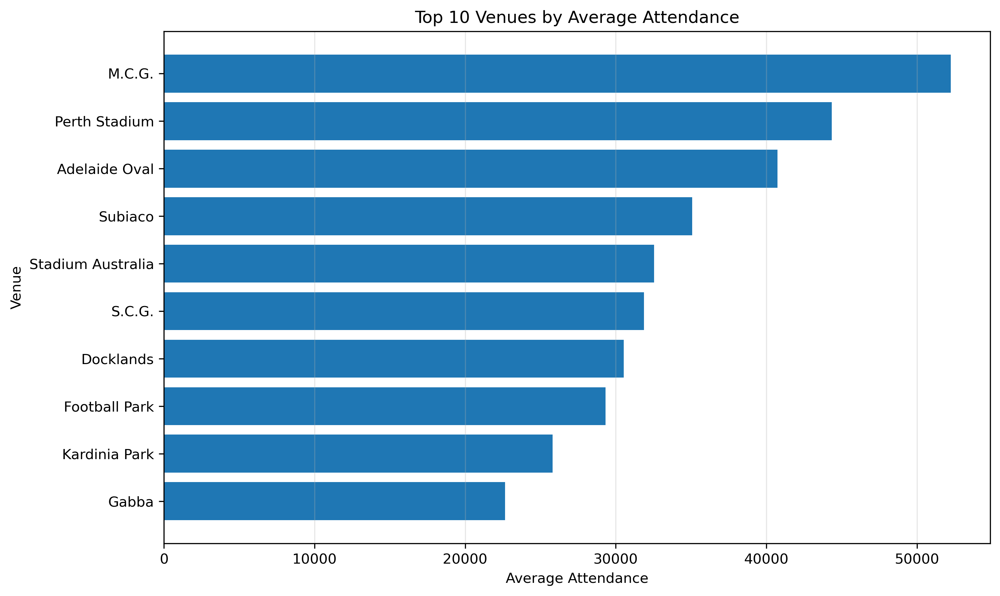
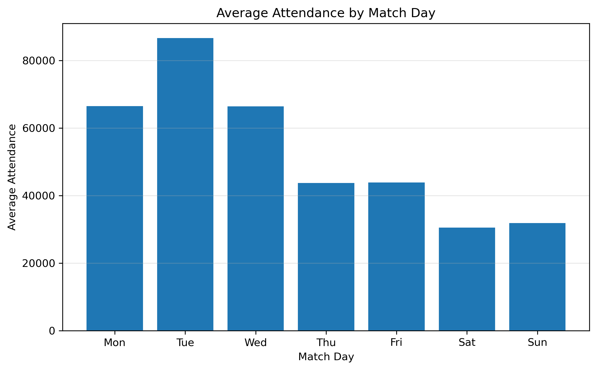
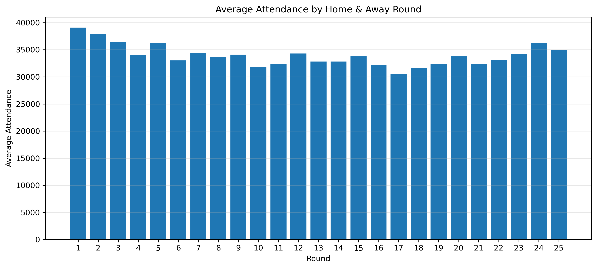

# AFL Matchday Attendance & Fan Engagement Analytics

## Project Overview

This project analyses AFL matchday attendance patterns using publicly available AFL Tables data. The aim is to understand how attendance varies across seasons, clubs, venues, rounds and matchdays, and to generate business-focused insights that could support fan engagement, venue planning and matchday operations.

## Business Question

**What AFL attendance patterns can support better fan engagement, venue planning and matchday operations?**

## Why This Project Matters

Attendance is one of the most important indicators of fan engagement in professional sport. For the AFL, understanding when and where crowds are strongest can support decisions around fixture planning, venue allocation, matchday staffing, marketing campaigns and fan experience.

This project treats AFL attendance as a real business analytics problem rather than only a sports statistics exercise.

## Dataset Source

Data was collected from AFL Tables and includes:

- Season-level attendance summaries
- AFL season pages from 2012 to 2025
- Match-level attendance, venue, date, teams, scores and results

The main analysis focuses on Home & Away matches from 2012 to 2025, excluding COVID-affected seasons 2020 and 2021 from the main comparison. Finals are kept in the dataset but analysed separately because crowd behaviour is different from regular season matches.

## Tools Used

- Python
- pandas
- NumPy
- BeautifulSoup
- requests
- DuckDB / SQL
- Matplotlib
- Jupyter Notebook
- GitHub

## Project Workflow

1. Collected AFL attendance data from AFL Tables.
2. Saved raw HTML files for reproducibility.
3. Cleaned season-level attendance data in Python.
4. Parsed match-level AFL season tables from 2012 to 2025.
5. Separated Home & Away matches from Finals.
6. Added COVID and main-analysis flags.
7. Saved cleaned datasets as CSV files.
8. Used SQL/DuckDB to answer business questions.
9. Created visualisations for GitHub presentation.
10. Planned machine learning extension to predict match attendance.

## Repository Structure

```text
afl-attendance-analytics/
│
├── data/
│   ├── raw/
│   └── processed/
│       ├── afl_match_attendance_clean.csv
│       └── afl_season_attendance_clean.csv
│
├── images/
│   ├── average_attendance_by_match_day.png
│   ├── average_attendance_by_round.png
│   ├── average_attendance_by_season.png
│   ├── top_home_clubs_by_attendance.png
│   └── top_venues_by_attendance.png
│
├── notebooks/
│   ├── 01_data_collection_cleaning.ipynb
│   ├── 02_sql_analysis.ipynb
│   └── 03_attendance_prediction_model.ipynb   # planned
│
├── sql/
│   └── attendance_queries.sql
│
├── README.md
├── requirements.txt
└── .gitignore
```

## Cleaned Data Summary

Two cleaned datasets were created:

| Dataset | Description |
|---|---|
| `afl_season_attendance_clean.csv` | Season-level AFL attendance summary |
| `afl_match_attendance_clean.csv` | Match-level attendance, venue, teams, scores and match metadata |

The final match-level dataset contains 2,813 match records and 21 columns. The main analysis uses 2,402 Home & Away matches, excluding COVID-affected seasons and finals.

## Key Questions Answered With SQL

The SQL analysis answers questions such as:

- How has AFL average attendance changed by season?
- Which seasons had the highest and lowest average attendance?
- Which home clubs attract the largest crowds?
- Which venues have the highest average attendance?
- How does attendance vary by round?
- Which Home & Away matches had the highest attendance?
- How do finals crowds compare with regular season crowds?
- How does attendance vary by match day?
- Which club-venue combinations attract strong crowds?

## Key Insights

### 1. AFL attendance has strongly recovered after COVID-affected seasons

Among the main analysis seasons, the highest Home & Away average attendance was in 2024, with an average of about 37,455 per match. The next strongest seasons were 2025 and 2023. This suggests AFL crowd attendance has recovered strongly after the disrupted 2020 and 2021 seasons.



### 2. Collingwood is the strongest home-club attendance driver

Collingwood had the highest average home attendance in the main analysis period, averaging about 54,962 attendees per home match. Richmond, Essendon and Carlton also ranked strongly, showing the commercial importance of large Victorian clubs.



### 3. The MCG dominates AFL crowd attendance

The MCG had the highest average attendance among major AFL venues, averaging about 52,254 attendees across 551 Home & Away matches in the main analysis dataset. Perth Stadium and Adelaide Oval also had strong crowd averages, showing the importance of large-capacity venues outside Victoria.



### 4. Finals crowds are much larger than Home & Away crowds

Across non-COVID seasons in the dataset, finals averaged about 64,834 attendees, compared with about 33,825 for Home & Away matches. This confirms that finals should be analysed separately because they follow different demand patterns.

### 5. Match day averages need careful interpretation

Tuesday and Wednesday show very high average attendance, but these days have very few matches in the main dataset. These matches are often special fixtures, so they should not be compared directly with regular Saturday and Sunday fixtures without considering match count.



### 6. Later rounds need context because the fixture structure changed

Rounds 24 and 25 show strong average attendance, but these rounds only appear in more recent AFL seasons. They should not be directly compared with rounds that existed across the whole 2012 to 2025 period.



## Business Recommendations

1. **Use high-demand clubs strategically**  
   Large clubs such as Collingwood, Richmond, Essendon and Carlton consistently attract strong crowds. Matches involving these clubs can support premium scheduling, larger venues and higher matchday staffing.

2. **Treat special fixtures separately**  
   Special fixtures such as Anzac Day-style matches can distort weekday averages. These should be modelled separately from normal weekly fixtures.

3. **Prioritise venue-specific planning**  
   The MCG, Perth Stadium and Adelaide Oval show strong attendance potential. Venue planning should consider expected crowd size, transport demand and staffing requirements.

4. **Separate finals from regular season analysis**  
   Finals attendance is much higher than Home & Away attendance, so combining them can mislead regular-season planning.

5. **Use attendance prediction as the next decision-support layer**  
   A machine learning model can help estimate expected attendance before each match using pre-match information such as season, round, month, match day, home team, away team and venue.

## Limitations

- Weather, ticket prices, public holidays, team ladder position and player availability were not included.
- Some weekday averages are based on very small sample sizes.
- Rounds 24 and 25 only exist in recent seasons, so round comparisons need context.
- COVID-affected seasons were excluded from the main comparison because attendance conditions were not normal.
- The current project is descriptive and analytical; the next phase will add predictive modelling.

## Next Step: Attendance Prediction Model

The next planned notebook is:

```text
notebooks/03_attendance_prediction_model.ipynb
```

The modelling task will be:

**Predict Home & Away match attendance using only pre-match information.**

Planned features:

- season
- round
- month
- match_day
- home_team
- away_team
- venue

Target:

- attendance

Planned models:

- Baseline mean model
- Linear Regression
- Random Forest Regressor
- Gradient Boosting Regressor

Evaluation metrics:

- MAE
- RMSE
- R²

## Skills Demonstrated

- Data collection from public web sources
- HTML parsing and data cleaning
- Feature engineering
- SQL analysis using DuckDB
- Exploratory data analysis
- Data visualisation
- Business insight generation
- Reproducible GitHub project structure
- Planned machine learning regression workflow

## How to Run

```bash
pip install -r requirements.txt
```

Open the notebooks in order:

```text
notebooks/01_data_collection_cleaning.ipynb
notebooks/02_sql_analysis.ipynb
notebooks/03_attendance_prediction_model.ipynb
```

## Portfolio Summary

This project demonstrates an end-to-end data analytics workflow using a real Australian sports dataset. It combines Python, SQL, data cleaning, visualisation and business-focused interpretation to understand AFL fan attendance patterns and prepare the project for a predictive modelling extension.
